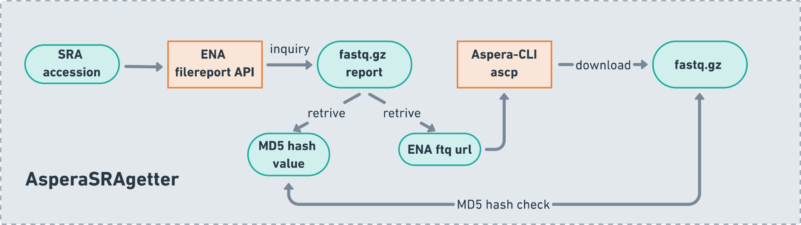

# AsperaSRAgetter
[](https://badge.fury.io/py/asperaSRAgetter)

AsperaSRAgetter provides an easy way to download sequencing data (fastq.gz format) from European Nucleotide Archive (ENA) by using Aspera.

## Installation
AsperaSRAgetter has been distributed on [pypi](https://pypi.org/project/AsperaSRAgetter/). You can easily install AsperaSRAgetter through pip. AsperaSRAgetter depends on Aspera-CLI to retrive sequencing data from ENA. It is recommended to install Aspera-CLI [with Conda](https://anaconda.org/hcc/aspera-cli).

```shell
# You may create a new environment for AsperaSRAgetter, but this is optional
conda create -n AsperaSRAgetter python=3.10
conda activate AsperaSRAgetter

# Install AsperaSRAgetter using pip
pip install AsperaSRAgetter

# Install Aspera-CLI using conda
conda install -c hcc aspera-cli
```

## Workflow

AsperaSRAgetter first inquiry for corresponding fastq.gz file report through [ENA filereport API](https://www.ebi.ac.uk/ena/portal/api/). Sencondly, the MD5 hash value and ftp url of each fastq.gz files are then resolved from the report. Lastly, ftp url is then passed to Aspera transfer command `ascp`
to download the fastq.gz file.

The file reports will be stored as a `.tsv` table as records of the downloading process. 

All files' MD5 hash values are saved in `.md5` file which users can further verify the integrity of files.

 

## Usage

The command name of AsperaSRAgetter is **sragetter**. It accepts either one SRA accession or one TXT file containing multiple accessions (see the usage example below). 
Note that users need to provide the path of public key authentication file of Aspera-CLI (normally should be ENVIRONMENT_PATH/etc/asperaweb_id_dsa.openssh)

```bash
usage: sragetter [-h] [-v] [-acc ACCESSION | -f FILE] -ssh SSH_KEY -o OUTDIR

options:
  -h, --help            show this help message and exit
  -v, --version         Show SRAdownloader version number and exit
  -acc ACCESSION, --accession ACCESSION
                        SRA data accession
  -f FILE, --file FILE  TXT file with multiple SRA accessions
  -ssh SSH_KEY, --ssh-key SSH_KEY
                        Public key authentication file provided by Aspera command line client download package as the 'asperaweb_id_dsa.openssh' file
  -o OUTDIR, --outdir OUTDIR
                        Path to store the downloaded SRA data

Usage
-----------------
Download with one accession:
    $ sragetter --accession sra_accession --ssh-key sshkey_path.openssh --outdir outdir_path

Download with TXT file containing multiple accessions:
    $ sragetter --file sra_accessions.txt --ssh-key sshkey_path.openssh --outdir outdir_path
```

## Contact
If you have any questions using AsperaSRAgetter, feel free to open an issue or contact me jirunjia@gmail.com.
